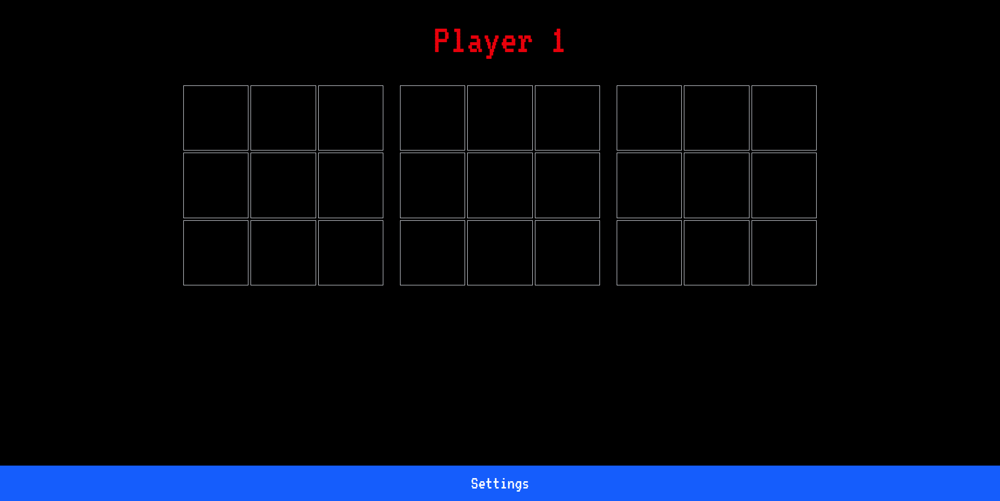

# Notakto

## 🧠 How to Play Notakto

**Notakto** is a [** misère and impartial form of tic-tac-toe**][1]. Also known as reverse tic-tac-toe, this variant turns the normal rules of tic-tac-toe on their head. It uses misère rules, which means if you line up three marks in a row, you _lose_. And it's impartial, so both players use **X** and play on one to more grids, or boards.

For example, to play notakto on three boards:

1. Player one puts an **X** in any position on any board.
1. Player two puts an **X** in any other position on any board.
1. Each player continues putting **X**s until they complete a row or column in a single board. That board is complete.
1. The player that completes the final board loses.

This turns the classic game of tic-tac-toe into a **zero-sum, strategic game**—similar to [**misère Nim**][2].

---

## ⚙️  Game Mechanics

* **Misère Rule Logic**: Completing the last three-in-a-row results in a loss.
* **Multi-board Play**: Users can play on 1 to 5 boards.
* **Configurable Sizes**: Each board can be up to 5x5.
* **Dead Board Detection**: Boards with a completed line are marked inactive.
* **Live Board Management**: AI or players skip dead boards.

---

### 🎮 Game Modes

1. **Single Player** – Play against AI with 5 difficulty levels.
2. **Two Player (Local)** – Play with a friend on the same device.
3. **Live Multiplayer** – Real-time matches over WebSocket.

---

### 🧠 AI Engine

* Uses **center-weighted heuristics** and **misère Nim strategy**.
* Implements perfect play logic at level 5.
* Easier difficulties add randomness to mimic mistakes.

---

### 🛍️ In-Game Economy

* **Coins** – Earned only by winning. Used for power-ups.
* **XP** – Earned by playing, even on losses. Used for leaderboards.

---

### 🪄 Power-ups

* **Undo Move**
* **Skip Move**

---

### 🌐 Multiplayer (Live Mode)

* Built using `socket.io-client` on the client and Socket.IO on the server.
* Server pairs players, manages rooms, synchronizes moves, and handles disconnects.
* Win conditions are checked on the server using classic Tic Tac Toe pattern checks.

---

### 💾 State Management

* Uses **Zustand** for clean separation

---

### 🔒 Authentication & Database

* Initially used Firebase for:

  * Google Auth
  * Cloud Firestore (coin, XP sync)

---

### 💸 Payments

* Coinbase Commerce integration for buying coins with crypto.

---

### 🎨 UI/UX

* **Retro 8-bit theme**
* Nostalgic sound effects
* Mobile-friendly interface
* Game board animation and interaction built for both mouse and touch

---

### 🚀 Future Features (Planned)

1. Global leaderboard (XP-based)
2. Friend list and “Play with Friends” mode
3. Ads integration with remove-ad purchase
4. Crash analytics, logging, and user tracking
5. GitOps-style CI/CD for auto-deploy
6. Automated test scripts

---

### Reference PPT
https://drive.google.com/file/d/1QHrSHDZumgNIxZhbl5kNWiP2y36SjO0U/view

[1]: https://en.wikipedia.org/wiki/Tic-tac-toe_variants
[2]: https://www.hackerrank.com/challenges/misere-nim-1/problem
