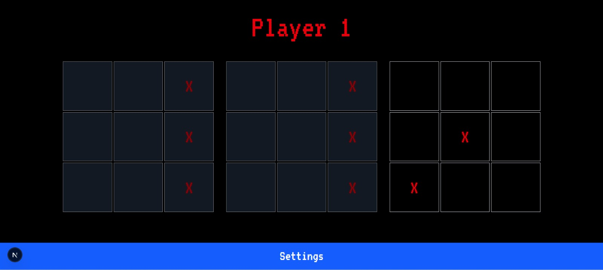

# ❌ Notakto

A misère-style twist on Tic-Tac-Toe. Both players play X — but the first to complete a line **loses**.

## 🧩 What is Notakto?

Notakto is a misère variant of Tic-Tac-Toe, combining logic from impartial games like **Nim** with the simplicity of classic **Tic-Tac-Toe**.

- Both players use **X**
- Completing a **three-in-a-row** causes you to **lose**
- Played on **1 to 5 boards** simultaneously
- Once a board has a line, it’s **dead** (unplayable)
- Last player forced to move on the final active board **loses**

## 🕹️ How to Play

1. Choose the number of boards (1–5) and board size (up to 5×5).
2. Take turns placing **X** on any active board.
3. Avoid forming a line of 3 or more.
4. Boards with completed lines become inactive.
5. Outlast your opponent by forcing them to complete the final line!

## 🎮 Game Modes

- **Single Player**: Play against AI with 5 difficulty levels.
- **Two Player (Local)**: Play with a friend on the same device.
- **Live Multiplayer**: Real-time matches over WebSocket.

## 🤖 AI Engine

- Center-weighted heuristics and misère Nim strategy.
- Implements perfect play logic at level 5.
- Easier difficulties add randomness to mimic mistakes.

## 🛍️ In-Game Economy

- **Coins**: Earned by winning; used for power-ups.
- **XP**: Earned by playing; used for leaderboards.

## 🪄 Power-ups

- **Undo Move**: Revert your last move.
- **Skip Move**: Skip your turn strategically.

## 🌐 Multiplayer (Live Mode)

- Built using `socket.io-client` on the client and `Socket.IO` on the server.
- Server pairs players, manages rooms, synchronizes moves, and handles disconnects.
- Win conditions are checked on the server using classic Tic-Tac-Toe pattern checks.

## 💾 State Management

- Utilizes **Zustand** for clean separation of concerns.

## 🔒 Authentication & Database

- Initially used Firebase for:
  - Google Auth
  - Cloud Firestore (coin, XP sync)

## 💸 Payments

- Coinbase Commerce integration for buying coins with cryptocurrency.

## 🎨 UI/UX

- Retro 8-bit theme with nostalgic sound effects.
- Mobile-friendly interface with animations and touch/mouse support.

## 🚀 Future Features (Planned)

- Global leaderboard (XP-based).
- Friend list and “Play with Friends” mode.
- Ads integration with remove-ad purchase.
- Crash analytics, logging, and user tracking.
- GitOps-style CI/CD for auto-deploy.
- Automated test scripts.

## 📸 Screenshots / Demo GIFs *(TODO)*

## 🧪 Dev Quickstart

-git clone https://github.com/Rakshitg600/notakto-website.git
-cd notakto-website
-npm install
-npm start

## 🤝 Contributing

Pull requests are welcome! Please ensure your PR:

* Improves clarity or adds missing details.
* Fixes typos or structure (not superficial).
* Does not make trivial formatting-only changes.

## 📄 License

This project is licensed under the MIT License. See the [LICENSE](LICENSE) file for details.

 

